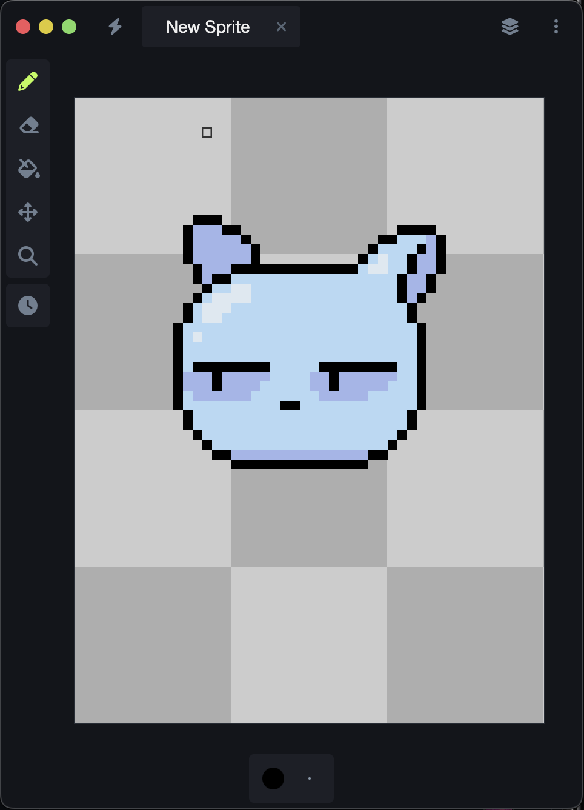

# PIXIE
Pixie is an experimental cross-platform pixel art editor, meant to explore how well HTML canvas, react, and webviews can be used in image editing software.

## Requirements
- yarn
- make
- android studio (for android build)
- xcode-tools (for ios build)

## Make Commands
- `make install`
    - Installs node modules for the root (build) project, along with the client (web) and electron (desktop).
- `make web`
    - Runs pixie as a live-reloading web app on `localhost:1234`.
- `make desktop`
    - Runs pixie as a live-reloading native app.
- `make android`
    - Runs pixie in the Android emulator.
- `make android.device`
    - Attempts to run pixie on the first available physical android device, connected to this system.
- `make ios`
    - Runs pixie in the iOS simulator.

## Known issues
The binary format for a pixie document needs real work.
